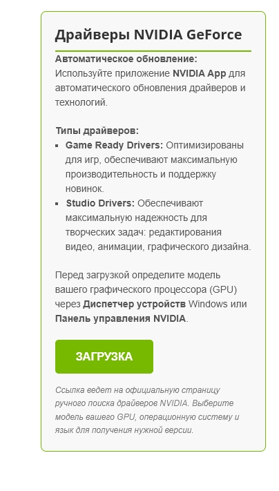

# Блок NVIDIA Driver для WordPress


Красивый и функциональный блок для WordPress с кнопкой загрузки драйверов NVIDIA.

## 🚀 Быстрый старт

### Вариант 1: Копирование готового блока
1. Откройте файл [`wordpress-block.html`](wordpress-block.html)
2. Скопируйте ВЕСЬ код из файла
3. Вставьте в WordPress через блок "Пользовательский HTML"

### Вариант 2: Использование отдельных файлов
Скопируйте код из:
- [`index.html`](index.html) - HTML структура
- [`style.css`](style.css) - Стили (опционально)

## 🖥️ Предварительный просмотр



**Особенности:**
- ✅ Адаптивный дизайн
- ✅ Стилизованная кнопка с hover-эффектом
- ✅ Информационный блок о драйверах
- ✅ Совместимость с WordPress 5.0+
- ✅ Чистый валидный HTML/CSS

## 📦 Установка

### Для WordPress:
1. **Метод Gutenberg** (рекомендуется):
   - Создайте/редактируйте страницу
   - Добавьте блок "Пользовательский HTML"
   - Вставьте код из `wordpress-block.html`

2. **Классический редактор**:
   - Переключитесь на вкладку "Текст"
   - Вставьте код в нужное место

### Для обычного сайта:
Просто подключите `style.css` и вставьте HTML из `index.html`

## 🎨 Кастомизация

### Изменение цветов
Отредактируйте значения в CSS:
```css
--primary-color: #76b900;  /* Основной зеленый NVIDIA */
--hover-color: #5a8c00;    /* Цвет при наведении */
--bg-color: #f8f8f8;       /* Фон блока */


## 2. Файл `wordpress-block.html` (готовая версия для WordPress)

```html
<!-- 
===========================================
Блок драйверов NVIDIA для WordPress
Версия: 1.0
Автор: Ваше имя/компания
===========================================
-->

<!-- Скопируйте ВЕСЬ этот код и вставьте в блок "Пользовательский HTML" в WordPress -->
<style>
.nvidia-driver-block {
    border: 1px solid #76b900;
    border-radius: 8px;
    padding: 25px;
    margin: 25px 0;
    font-family: -apple-system, BlinkMacSystemFont, 'Segoe UI', Roboto, Oxygen, Ubuntu, sans-serif;
    background-color: #f8f8f8;
    box-shadow: 0 4px 12px rgba(0,0,0,0.05);
    transition: transform 0.3s ease, box-shadow 0.3s ease;
}

.nvidia-driver-block:hover {
    transform: translateY(-2px);
    box-shadow: 0 6px 16px rgba(0,0,0,0.08);
}

.nvidia-driver-block h3 {
    color: #333;
    margin-top: 0;
    margin-bottom: 20px;
    padding-bottom: 15px;
    border-bottom: 2px solid #76b900;
    font-size: 22px;
    font-weight: 600;
    display: flex;
    align-items: center;
    gap: 10px;
}

.nvidia-driver-block h3:before {
    content: "▸";
    color: #76b900;
    font-size: 24px;
}

.driver-info {
    margin-bottom: 25px;
    line-height: 1.6;
    color: #555;
    font-size: 15px;
}

.driver-info p {
    margin-bottom: 12px;
}

.driver-info strong {
    color: #333;
}

.driver-info ul {
    margin: 15px 0;
    padding-left: 20px;
}

.driver-info li {
    margin-bottom: 8px;
    position: relative;
    padding-left: 10px;
}

.driver-info li:before {
    content: "•";
    color: #76b900;
    position: absolute;
    left: -10px;
}

.driver-button {
    display: inline-flex;
    align-items: center;
    justify-content: center;
    gap: 10px;
    background: linear-gradient(135deg, #76b900 0%, #5a8c00 100%);
    color: white;
    padding: 14px 35px;
    text-decoration: none;
    border-radius: 6px;
    font-weight: bold;
    font-size: 16px;
    transition: all 0.3s ease;
    text-align: center;
    border: none;
    cursor: pointer;
    box-shadow: 0 4px 10px rgba(118, 185, 0, 0.2);
    position: relative;
    overflow: hidden;
}

.driver-button:before {
    content: "⬇";
    font-size: 18px;
}

.driver-button:hover {
    background: linear-gradient(135deg, #5a8c00 0%, #476c00 100%);
    transform: translateY(-2px);
    box-shadow: 0 6px 15px rgba(118, 185, 0, 0.3);
}

.driver-button:active {
    transform: translateY(0);
}

.driver-note {
    font-size: 13px;
    color: #666;
    margin-top: 20px;
    padding-top: 15px;
    border-top: 1px dashed #ddd;
    line-height: 1.5;
}

/* Адаптивность */
@media (max-width: 768px) {
    .nvidia-driver-block {
        padding: 20px;
        margin: 15px 0;
    }
    
    .nvidia-driver-block h3 {
        font-size: 20px;
    }
    
    .driver-button {
        width: 100%;
        padding: 12px 20px;
    }
}
</style>

<div class="nvidia-driver-block">
    <h3>Драйверы NVIDIA GeForce</h3>
    
    <div class="driver-info">
        <p><strong>🚀 Автоматическое обновление:</strong> Используйте приложение <strong>NVIDIA App</strong> для автоматического обновления драйверов и технологий.</p>
        
        <p><strong>🎮 Типы драйверов:</strong></p>
        <ul>
            <li><strong>Game Ready Drivers:</strong> Оптимизированы для игр, обеспечивают максимальную производительность и поддержку новинок</li>
            <li><strong>Studio Drivers:</strong> Обеспечивают максимальную надежность для творческих задач</li>
        </ul>
        
        <p><strong>ℹ️ Как определить модель GPU?</strong></p>
        <p>Откройте <strong>Диспетчер устройств</strong> → <strong>Видеоадаптеры</strong> или <strong>Панель управления NVIDIA</strong> → <strong>Системная информация</strong>.</p>
    </div>
    
    <a href="https://www.nvidia.com/en-eu/geforce/drivers/" target="_blank" rel="noopener noreferrer" class="driver-button">
        ЗАГРУЗКА
    </a>
    
    <div class="driver-note">
        <p>Ссылка ведет на официальную страницу загрузки драйверов NVIDIA. После перехода выберите модель вашего GPU, операционную систему и язык.</p>
    </div>
</div>
